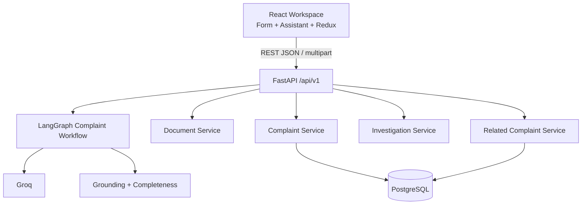
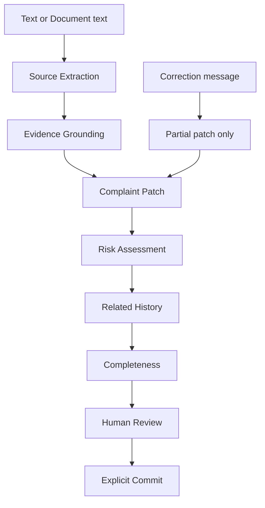

# VeyraQ

AI-assisted pharmaceutical customer complaint intake for API and FDF contexts.

VeyraQ helps QA personnel turn unstructured complaint text or documents into a structured Log Customer Complaint draft, supports conversational corrections, surfaces advisory risk and related history, and commits only when a human explicitly approves.

Assessment project for the AI Product Engineer internship at AIVOA.

---

## 1. What it is

A focused **complaint intake module** — not a full QMS. It covers intake, structuring, human review, and commit to a QMS-style PostgreSQL record store.

## 2. Why this problem matters

Customer complaints arrive as email, free text, or attachments. Manual transcription is slow and inconsistent. QA still needs provenance they can trust: what came from the customer, what the user corrected, what the model only suggested, and what remains unknown.

## 3. Assessment workflow implemented

1. Paste complaint text or upload PDF/TXT/EML  
2. AI extracts structured fields (grounded source values)  
3. Form populates with provenance  
4. Advisory risk assessment  
5. Conversational corrections update **only** corrected fields  
6. Completeness → Needs Information or Ready to Commit  
7. Optional related-history and on-demand Investigation Assistance  
8. Human explicitly commits  

## 4. Key design decisions

1. **Grounded source extraction** — evidence spans must appear in the source text; otherwise the field is dropped, not stored as source.  
2. **Missing stays missing** — no plausible invented quantities, dates, or harm.  
3. **Corrections are partial patches** — unrelated fields keep value, provenance, and evidence.  
4. **Provenance** — `source` / `user` / `inferred` / `missing`, co-located with each field value.  
5. **Source date precision preserved** — dates are intake strings (`April 2026`), not coerced timestamps.  
6. **AI does not auto-commit** — drafts live in Redux until explicit commit.  
7. **Related complaints are deterministic** — explainable scores/reasons; no embeddings.  
8. **RCA outputs are hypotheses** — not confirmed findings.  
9. **CAPA outputs are suggestions** — not approved actions or a CAPA lifecycle.  
10. **Documents share the same intelligence workflow** — extract text, then the same LangGraph path.  
11. **Draft vs committed boundary** — committed rows are immutable through the current API.

## 5. Architecture



Details: [docs/ARCHITECTURE.md](docs/ARCHITECTURE.md)

## 6. AI reliability model



Investigation Assistance is a separate on-demand call. It is **not** required for commit and does not mutate complaint fields.

## 7. Feature coverage

| Area | Status |
| --- | --- |
| Text + document intake | Implemented |
| Provenance-aware form | Implemented |
| Conversational patch corrections | Implemented |
| Completeness + Ready to Commit | Implemented |
| Advisory risk | Implemented |
| Related historical complaints | Implemented |
| Investigation Assistance (summary / RCA / CAPA) | Implemented |
| Explicit commit to PostgreSQL | Implemented |

Requirement map: [docs/ASSESSMENT_CHECKLIST.md](docs/ASSESSMENT_CHECKLIST.md)

## 8. Technology stack

| Layer | Technologies |
| --- | --- |
| Frontend | React, TypeScript, Vite, Redux Toolkit, CSS Modules, Inter |
| Backend | Python 3.12, FastAPI, Pydantic, SQLAlchemy 2.0, Alembic, PyMuPDF |
| Database | PostgreSQL |
| AI | LangGraph StateGraph, Groq (official SDK) |

Groq model IDs are environment-configurable (`GROQ_MODEL`, default `openai/gpt-oss-20b`). Older assessment example model IDs may no longer be available on current Groq developer access.

## 9. Local setup

**Prerequisites:** Node.js 22 LTS, Python 3.12, PostgreSQL.

### Frontend

```bash
cd frontend
cp .env.example .env
npm install
npm run dev
```

App: http://localhost:5173

### Backend

```bash
cd backend
py -3.12 -m venv .venv
# Windows: .venv\Scripts\activate
# macOS/Linux: source .venv/bin/activate
python -m pip install --upgrade pip
pip install -e ".[dev]"
cp .env.example .env
```

```bash
uvicorn app.main:app --reload --port 8000
```

- Liveness: `GET /api/v1/health`
- Readiness: `GET /api/v1/readiness` (needs PostgreSQL)
- OpenAPI: http://localhost:8000/docs

## 10. Environment variables

| Variable | Where | Purpose |
| --- | --- | --- |
| `VITE_API_BASE_URL` | `frontend/.env` | API base (default `http://localhost:8000/api/v1`) |
| `VITE_MAX_UPLOAD_BYTES` | `frontend/.env` | Client upload limit (default `4194304` / 4 MiB) |
| `DATABASE_URL` | `backend/.env` | PostgreSQL SQLAlchemy URL |
| `CORS_ORIGINS` | `backend/.env` | Allowed browser origins (comma-separated) |
| `GROQ_API_KEY` | `backend/.env` | Groq secret — **never commit** |
| `GROQ_MODEL` | `backend/.env` | Model id |
| `MAX_UPLOAD_BYTES` | `backend/.env` | Server upload limit (default `4194304` / 4 MiB) |

Assistant text limit: 12,000 characters.  
Documents: PDF/TXT/EML · **4 MiB** · 20 PDF pages · 20,000 extracted characters (reject, never truncate).

## 11. Database / migrations

```bash
cd backend
alembic upgrade head
python -m app.scripts.seed_demo_complaints
```

Seed data is fictional and idempotent (`CMP-DEMO-*`). Automated tests use in-memory SQLite and do not require PostgreSQL.

## 12. Running tests

```bash
# Frontend
cd frontend
npm run lint
npm test -- --run
npm run build
npm run test:e2e

# Backend
cd backend
pytest
alembic upgrade head --sql
```

Playwright E2E mocks the AI/commit HTTP boundary so CI stays deterministic. It does not inject fake behavior into production runtime.

## 13. Demo scenarios

Reusable fixtures live in [`demo/`](demo/DEMO_DATA.md):

- **Text / FDF:** `demo/complaint-email.txt` — NovaCare / Cefixime / `CFX260481`
- **PDF / API:** `demo/complaint-report.pdf` — Northstar / Metformin Hydrochloride API
- **Correction:** `Correction: 30 capsules were affected.`
- **Related history:** seeded `CMP-DEMO-0001` and `CMP-DEMO-0002`

Recording plan: [docs/DEMO.md](docs/DEMO.md)

## 14. Production deployment (Vercel)

Deploy the monorepo as **two Vercel projects** (frontend Vite + backend FastAPI) with Neon PostgreSQL and Groq.

Full guide: [docs/DEPLOYMENT.md](docs/DEPLOYMENT.md)

## 15. Limitations / production considerations

- Assessment prototype — not a validated production QMS  
- Authentication / RBAC would be required for real regulated deployment  
- No electronic-signature / Part 11 implementation  
- No production OCR for scanned documents  
- Complaint history search sized for a small assessment dataset  
- AI recommendations require human QA review  
- No formal CAPA lifecycle persistence  
- No external SOP / document retrieval  
- No real patient or confidential customer data used  
- Vercel preview origins are not CORS-whitelisted by default  

---

## Documentation

| Document | Purpose |
| --- | --- |
| [docs/PROJECT_CONTEXT.md](docs/PROJECT_CONTEXT.md) | Authoritative project context |
| [docs/PRD.md](docs/PRD.md) | Requirements |
| [docs/ARCHITECTURE.md](docs/ARCHITECTURE.md) | System design |
| [docs/DOMAIN.md](docs/DOMAIN.md) | Domain assumptions |
| [docs/DESIGN.md](docs/DESIGN.md) | UI direction |
| [docs/AI_WORKFLOW.md](docs/AI_WORKFLOW.md) | LangGraph + reliability |
| [docs/ASSESSMENT_CHECKLIST.md](docs/ASSESSMENT_CHECKLIST.md) | Requirement → implementation map |
| [docs/DEPLOYMENT.md](docs/DEPLOYMENT.md) | Vercel + Neon production deployment |
| [docs/INTERVIEW_NOTES.md](docs/INTERVIEW_NOTES.md) | Architecture Q&A prep |
| [docs/DEMO.md](docs/DEMO.md) | Video recording plan |
| [docs/PHASES.md](docs/PHASES.md) | Implementation phases |
| [docs/RULES.md](docs/RULES.md) | Coding-assistant rules |
