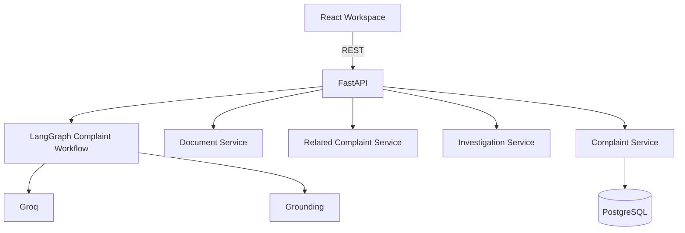
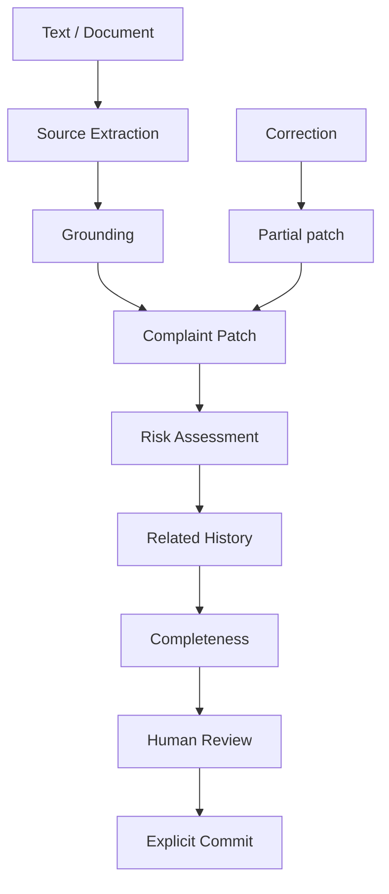

# ARCHITECTURE — System Design

## 1. Architectural intent

VeyraQ uses a **simple, interview-explainable** layered architecture:

```
React (Vite + TS) + Redux Toolkit
        │  HTTP/JSON
        ▼
FastAPI + Pydantic
        │
        ├── LangGraph StateGraph ──► Groq (LLM)
        │
        └── SQLAlchemy 2.x / Alembic ──► PostgreSQL
```

Principles:
- Prefer boring, understandable engineering.
- No microservices, queues, or clever abstractions before necessity.
- AI assists humans; persistence of committed records is an explicit user action.
- Boundaries stay clear so the code walkthrough can follow one linear path.

---

## 2. System boundaries

### 2.1 Frontend
**Owns:** UI, local interaction state, Redux complaint draft state, Copilot UX, provenance presentation, commit confirmation UX.

**Does not own:** Prompt text as source of truth, LLM calls, database writes, document binary parsing beyond upload.

**Stack:** React, TypeScript, Vite, Redux Toolkit, CSS Modules, Inter, semantic/accessible components.

### 2.2 Backend (API)
**Owns:** HTTP API, request validation (Pydantic), orchestration of AI workflow, document text extraction, completeness/readiness evaluation endpoints (or workflow-embedded), persistence of drafts/commits.

**Does not own:** Frontend styling, Redux store shape as UI concern (API contracts are shared via schemas).

**Stack:** Python, FastAPI, Pydantic, SQLAlchemy 2.x, Alembic.

### 2.3 AI workflow
**Owns:** Intent detection, extraction, normalization, validation, completeness check, risk assessment, patch extraction/application logic, optional later duplicate/root-cause/CAPA suggestion nodes.

**Does not own:** Silent mutation of stored committed records; inventing missing facts; autonomous multi-agent systems.

**Stack:** LangGraph StateGraph, Groq SDK/API, centrally stored prompts, schema-validated structured outputs.

### 2.4 Database
**Owns:** Persistent storage for complaint records (and supporting entities as needed for drafts/commits/duplicates if implemented).

**Stack:** PostgreSQL.

### 2.5 Document processing
**Owns:** Extracting plain text from uploaded files when practical.

**Rules:** PyMuPDF for normal PDF text; simple TXT/EML if practical; **no** production OCR.

---

## 3. High-level components

| Component | Responsibility |
| --- | --- |
| Complaint Form (left pane) | Displays structured fields, provenance, status, highlights |
| VeyraQ Copilot (right pane) | Text input, corrections, uploads, follow-ups |
| Redux store | Authoritative client-side complaint draft + UI status |
| FastAPI routers | Intake, correct, upload, commit, health |
| LangGraph workflow | Stateful complaint processing graph |
| Prompt registry | Central prompt storage |
| Groq client | Model calls via env-configured model IDs |
| Persistence layer | SQLAlchemy models + Alembic migrations |
| Completeness / risk modules | Workflow nodes producing advisory + readiness signals |
| Document service | In-memory PDF/TXT/EML text extraction (no persistence, no OCR) |
| Related-complaint service | Deterministic scoring against committed history (no embeddings / no extra LLM) |
| Investigation service | On-demand summary + RCA hypotheses + CAPA suggestions (one Groq structured call; not persisted) |

---

## 4. Primary data flows

### 4.1 Text intake

1. User submits complaint text in the Assistant composer.
2. Frontend adds the user message to Assistant state, sets complaint status to `processing` (prior status is remembered for failure restore), and `POST /api/v1/assistant/process` with the message plus current `ComplaintFields`.
3. FastAPI validates the request (blank/oversized text → 422) and invokes the LangGraph complaint graph. Client status is not trusted.
4. Graph: `determine_intent` → extract / ground / merge → optional `assess_risk` → `lookup_related_complaints` → `check_completeness` → `prepare_response`.
5. Groq calls happen only through `GroqService` (structured JSON-schema outputs, Pydantic-validated).
6. API returns `{ intent, patch, status, missing_required_fields, assistant_message, related_complaints, related_lookup_evaluated }`.
7. On success, Redux `applyFieldPatch` merges only `patch.changes` and sets the server status. Related matches are stored in assistant analysis state (not `ComplaintFields`). On failure, fields and prior status are unchanged.

### 4.2 Correction (patch)

1. User sends a natural-language correction against a non-empty draft.
2. Frontend posts the same `/assistant/process` endpoint with the current field snapshot.
3. Graph: `determine_intent` → `extract_correction_patch` → `validate_correction` → `merge_patch` → risk reassessment only if a risk-relevant field changed → completeness → response.
4. Response contains **only** patched field updates (plus refreshed assessment fields when required).
5. Redux merges the patch; unrelated fields remain untouched; UI highlights changed fields.

If the draft is already populated and intent is a different new complaint, the graph does **not** overwrite the draft.

### 4.3 Document intake

1. User selects a PDF, TXT, or EML file in the Assistant panel (drag/drop or file chooser) and explicitly chooses **Analyze Document**.
2. Frontend posts multipart `file` + `current_fields` JSON to `POST /api/v1/assistant/process-document`. The browser sets the multipart boundary; clients must not set `Content-Type` manually.
3. Backend validates size/type, extracts plain text **in memory** via `document_service` (PyMuPDF for PDF; stdlib for TXT/EML). Uploads are never written to disk or PostgreSQL.
4. If the current draft is already populated, the API returns **409** and does not overwrite.
5. Extracted text enters the **same** LangGraph complaint workflow (`build_complaint_graph`) as text intake, with `input_kind=document`. Empty-draft intent is deterministically `new_complaint` (no intent LLM call).
6. Response reuses the assistant process contract (`intent`, `patch`, `status`, `missing_required_fields`, `assistant_message`) plus optional `{ filename, document_type }` metadata.
7. Redux applies the patch with existing `applyFieldPatch`. Failures leave the draft unchanged.

Scanned/image-only PDFs fail with a clear 422. OCR is intentionally not implemented.

### 4.4 Investigation Assistance (on-demand)

1. After reviewing the draft (and optional related history), the user explicitly clicks **Generate Investigation Assistance**.
2. Frontend posts current `ComplaintFields` to `POST /api/v1/assistant/investigation`.
3. Backend requires `product_name` and `complaint_description`; optionally loads related-history signals server-side.
4. `InvestigationService` performs **one** structured Groq call (no additional LangGraph) and semantically validates supporting fields.
5. Response is derived analysis only — never a `ComplaintPatch`. Complaint fields, status, severity, and priority are unchanged.
6. Analysis is transient client state and clears when complaint fields or related-history results change.

### 4.5 Commit

1. Frontend enables commit only when status is Ready to Commit (per server/client rules aligned with completeness).
2. User explicitly confirms commit.
3. FastAPI persists Committed record in PostgreSQL.
4. Redux reflects Committed status.

### 4.6 Failure isolation

If Groq/LangGraph fails or returns invalid schema:
- API returns a clear error.
- Existing Redux complaint draft is **not** overwritten with partial garbage.
- Status may reflect failure for the processing attempt without destroying prior good state.

---

## 5. API surface (conceptual)

Implemented under **`/api/v1`**:

| Group | Purpose |
| --- | --- |
| `POST /assistant/process` | Text complaint extraction and conversational correction |
| `POST /assistant/process-document` | Document upload (PDF/TXT/EML) → text extraction → same LangGraph workflow |
| `POST /assistant/investigation` | On-demand Investigation Assistance (summary / RCA hypotheses / CAPA) |
| `POST /complaints/commit` | Explicit human commit |
| `GET /complaints` | List committed complaints |
| `GET /complaints/{id}` | Retrieve a committed complaint |
| `GET /health` | Liveness |
| `GET /readiness` | Readiness including DB |

Assistant request text is limited to **12,000 characters**. Document uploads are limited to **8 MB**, **20 PDF pages**, and **20,000 extracted characters** (reject, never silently truncate). Blank messages return 422. AI provider failures return 503 without mutating the client draft.

Request/response contracts use Pydantic models shared conceptually with frontend types.

---

## 6. State ownership

| State | Owner |
| --- | --- |
| Active draft being edited in UI | Redux (client) until explicit commit |
| Processing / highlight / Copilot chat UX | Redux `assistant` slice (messages, requestStatus, error) plus complaint `recentlyUpdatedFields` |
| AI workflow ephemeral state | LangGraph state object (server, per request) |
| **Committed** complaint records | PostgreSQL only |

**Locked:** Complaint drafts remain client-side in Redux until the user explicitly commits. PostgreSQL stores committed complaints. Do not auto-persist drafts.

### Draft field contract (locked)

- Frontend and backend share one conceptual complaint contract (mirrored TypeScript + Pydantic).
- Each canonical field is a `ComplaintFieldValue`: `{ value, provenance, confidence, evidence }` co-located—not a separate provenance map.
- Uncommitted draft lives in Redux under the `complaint` slice (`fields`, `status`, `recentlyUpdatedFields`, plus commit metadata).
- Updates that change only some fields use an explicit **`ComplaintPatch`** (`changes` map). Never “replace the whole regenerated complaint” as the correction contract.

### Persistence boundary (Phase 4)

```text
Redux draft → POST /api/v1/complaints/commit → service validation
  → repository → SQLAlchemy Complaint → PostgreSQL
  → CommittedComplaintResponse → Redux status=committed
```

- **SQL columns** store authoritative field values (dates remain strings).
- **`field_metadata` JSON** stores only `{ provenance, confidence, evidence }` per field — not duplicate values.
- Server generates `id` (UUID) and `complaint_number` (`CMP-{year}-{suffix}`); clients cannot supply them on commit.
- Commit validation is **server-enforced** (required fields); frontend `ready_to_commit` is not trusted.
- No `PUT` / `PATCH` / `DELETE` for committed records in this assessment API.
- Read-only: `GET /api/v1/complaints`, `GET /api/v1/complaints/{id}`.
- Layers: routes → `ComplaintService` → `ComplaintRepository` → model.

---

## 7. AI integration boundary

```
FastAPI POST /api/v1/assistant/process
  → GroqService (only Groq SDK boundary)
  → build_complaint_graph(ai_service)
  → StateGraph.invoke(initial state)
  → nodes call ai_service.structured_completion(...)
  → deterministic evidence grounding + patch merge
  → completeness → status
  → ComplaintPatch DTO
  → Redux applyFieldPatch + setComplaintStatus
```

Rules:
- One understandable stateful workflow (not a swarm of agents).
- All Groq client construction and `chat.completions.create` calls live in `app/services/groq_service.py`.
- LangGraph nodes receive an `AIService` protocol; tests inject a fake service.
- Model name/ID from `GROQ_MODEL` (default `openai/gpt-oss-20b`).
- Secrets from `GROQ_API_KEY` only.
- Prompts centralized in `app/agents/prompts.py`.
- Structured outputs use JSON Schema with strict mode enabled for the default model.
- The original assessment names `gemma2-9b-it` and mentions `llama-3.3-70b-versatile`. Those IDs are no longer generally available on current Groq developer access. VeyraQ keeps Groq as the required provider; the model remains configurable.

Details: `AI_WORKFLOW.md`.

---

## 8. Database boundary

PostgreSQL stores QMS-style complaint records suitable for the assessment demo.

Minimum conceptual entities (names may vary in implementation):
- Complaint record (core fields, status, timestamps)
- Field provenance metadata (per-field or structured JSON with clear schema)
- Advisory assessment snapshot (severity, next action, risk text)
- Optional: document reference metadata; duplicate-check support fields

Alembic manages migrations. SQLAlchemy 2.x is the ORM.

---

## 9. Testing architecture

| Layer | Tool | Focus |
| --- | --- | --- |
| Backend | Pytest | API contracts, patch merge semantics, schema validation, workflow unit tests with mocked Groq where appropriate |
| Frontend | Vitest | Redux reducers/selectors, provenance display helpers |
| E2E | Playwright | **One** critical path: intake → form populate → correct patch → ready/commit (as feasible with test doubles or staged env) |

---

## 10. Architectural rationale

| Decision | Why |
| --- | --- |
| Monolith FastAPI + SPA | Assessment clarity; easy walkthrough |
| Redux Toolkit | Mandatory Redux; RTK is current, boring, teachable |
| LangGraph StateGraph | Mandatory; clear nodes for demo |
| Groq | Mandatory LLM provider |
| PostgreSQL | Mandatory durable store for commit |
| CSS Modules | Scoped styling without heavy UI framework lock-in |
| No Redis/Kafka/Celery | Out of scope; unnecessary for intake module |
| No RAG/vector DB | Out of scope; hallucinations controlled by provenance + schema, not retrieval stack |

---

## 11. Locked implementation decisions

| Decision | Choice |
| --- | --- |
| Monorepo folders | `frontend/`, `backend/` |
| API prefix | `/api/v1` |
| Draft persistence | Client-side Redux only until explicit commit; PostgreSQL stores committed complaints |
| Duplicate detection source | Committed PostgreSQL history + small fictional seed data; **no** vector database |
| Database access style | Synchronous SQLAlchemy 2.0 (no async DB stack unless a later requirement justifies it) |
| Runtimes | Node.js 22 LTS (frontend); Python 3.12 (backend) |
| Groq model | Environment `GROQ_MODEL`; default `openai/gpt-oss-20b` (strict structured output) |
| Assistant input limit | 12,000 characters |
| Document intake | In-memory PDF/TXT/EML extraction via `document_service`; PyMuPDF; no persistence; no OCR |
| Related history | Deterministic scoring over up to 100 recent committed complaints; explainable reasons; no vector DB |
| Investigation Assistance | On-demand derived analysis via `InvestigationService` (not a second LangGraph); transient; never mutates ComplaintFields |

## 12. Still open (deferred)

None for the assessment feature set. Phase 10 closed the Playwright critical path and demo readiness work. Live Groq/PostgreSQL verification remains an environment responsibility for the candidate machine.

## 13. Architecture diagram (assessment)



## 14. AI workflow diagram



Investigation Assistance is on-demand and outside the commit-critical path.
